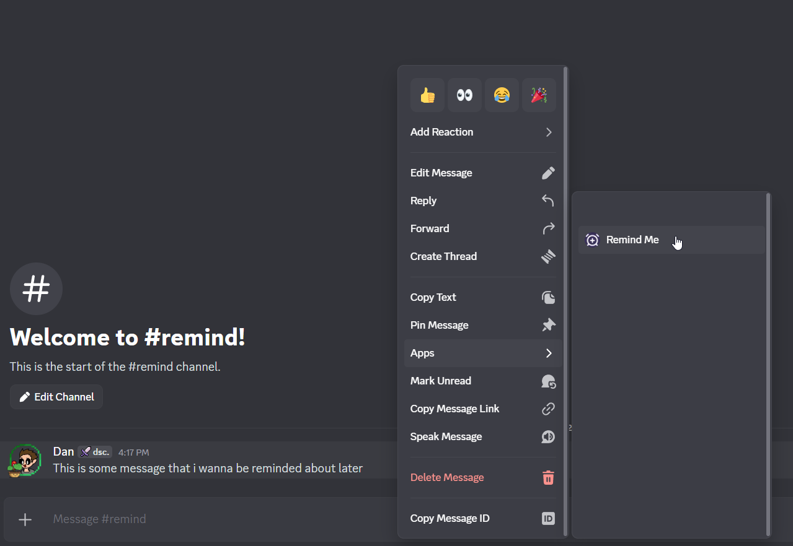
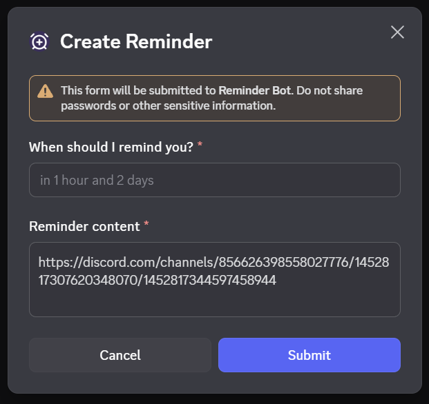
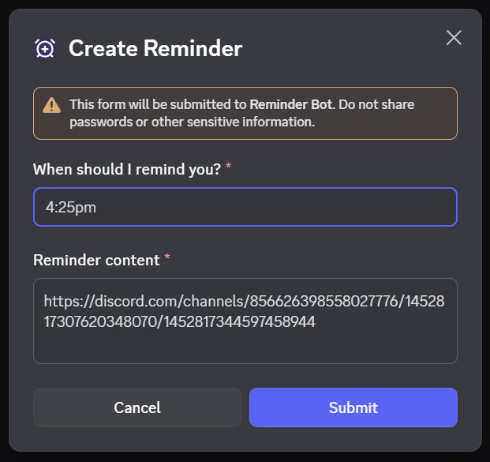
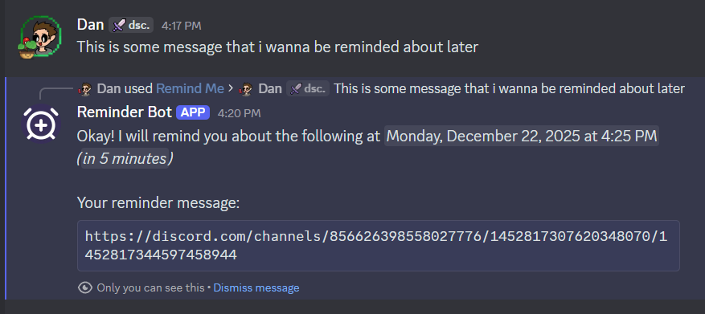

# Reminder Bot

A reminder bot using NLP for the Discord Buildathon 2025.

## Instructions

1. Install the app via <https://discord.com/oauth2/authorize?client_id=1451435856714793091>
2. Right click a message > Apps > Remind Me
3. Add when you'd like to be reminded (in 5 minutes, at 3 pm, 3:11pm, 5m, 15s, etc)
4. Submit to create the reminder.
5. Wait and receive your reminder.

## Screenshots

